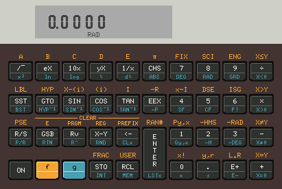

## x11-calc - Another RPN (Reverse Polish) calculator.

Simulators  for the HP 35, HP 80, HP 45, HP 70, HP 10, HP 21, HP 22,  HP25,
HP 25C,  HP 27,  HP 29C,  HP 31E, HP 32E, HP 33E, HP 33C,  HP 34C,  HP 37E,
HP 38C,  HP 38E, HP 67, HP 10C, HP 11C, HP 12C, HP 15 C, and HP 16C.

All written in C using X11.

Use  of any language extensions or non standard language features has  been
avoided in order to try to make the code as portable as possible.

The  aim  is to have the same source code compile without  modification  on
Linux, VAX/VMS, and Tru64 Unix.

Unlike all the other simulators the ROM images for the HP10C, HP11C, HP12C,
HP15C, HP16C are not defined in the the source code and must be loaded from
a separate ROM file.

 

More [screenshots](./img/)


### Latest News

03 Jun 23
   - Fixed compiler directive so keyboard works again on linux.
   - Fixed a problem in the make file.

01 May 23
   - Fixed ordering of compiler options (affecting recent versions of gcc).

23 Mar 23
   - Set compiler specific flags for gcc.

21 Dec 22
   - HP10 now prints to the console.

11 Dec 22
   - Added HP25, HP33E and HP38E models.
   - Renamed HP33 to HP33C, HP34 to HP34C, HP37 to HP37E, HP38 to HP38C.
   - Renamed HP25 to HP25C, HP29 to HP29C, HP31 to HP31E, HP32 to HP32E.
   - Renamed HP11 to HP11C, HP12 to HP12C, HP15 to HP15C, HP16 to HP16C.
   - Renamed HP10 to HP10C and added HP10.

### Status

##### HP 35  - Working

##### HP 80  - Working

##### HP 45  - Working

##### HP 70  - Working

##### HP 10  - Working

##### HP 21  - Working

##### HP 22  - Working

##### HP 25  - Working

##### HP 25C - Working

##### HP 27  - Working

##### HP 29C - Working

##### HP 31E - Working

##### HP 32E - Working

##### HP 33E - Working

##### HP 33C - Working

##### HP 34C - Working

##### HP 37E - Completed
* Fails self test.

##### HP 38E - Working

##### HP 38C - Working

##### HP 67  - Working
* Cannot read or write to magnetic cards.
* Has continuous memory.

##### HP 10C - Working

##### HP 11C - Working (More testing needed)

##### HP 12C - Working (More testing needed)

##### HP 15C - Working (More testing needed)

##### HP 16C - Working (More testing needed)


### Compiling

To  build the simulator on Linux check that you have all the  prerequisites
installed  then  download the source code from github and unzip it  (a  new
folder  will  be created to automatically).  Then change directory  to  the
new  folder run 'make all' build all the simulators.

e.g:

    $ wget https://github.com/mike632t/x11-calc/archive/refs/heads/stable.zip
    $ unzip stable.zip
    $ cd x11-calc-stable
    $ make all

    $ ./bin/x11-calc-29
    x11-calc-29: Version 0.4 [Commit ID: 81c55be] 16 Oct 21 21:15:00 (Build: 0067)
    ROM Size : 4096 words

If more than one C compiler is installed then you can specify which one to use  on
the command line.

    $ make CC=tcc VERBOSE=1 all

    $ make CC=clang VERBOSE=1 all


To build the simulator on **MacOS**, you have to have installed XQuartz from https://www.xquartz.org/ to support X11, before building. Other steps are the same (run ```make all``` in root directory of the source code).


### Keyboard Shortcuts

The following keyboard shortcuts should work on Linux:

'0' - '9', '+'. '-'. '*'. '/' and 'Enter' should do what you expect them to
(when using numeric key pad you need to use numlock as usual).

'f' and where applicable 'g' and 'h' correspond to the shift keys.

'Esc' or 'Backspace' corresponds to 'Clx', 'c' to CHS, 'e' to 'EEX', and on
financial models 'n' and 'i' correspond to 'n' and 'i' if not shifted.

On programmable models 'A' - 'E' correspond to the function keys where they
exist and 'Space' to 'SST' if not shifted

'Ctrl-Z'  Quits,  and  'Ctrl-C' does a reset.  For models  with  continuous
memory 'Ctrl-Z' saves the current register contents, and 'Ctrl-C'  restores
them to the original saved state.


### Loading and saving

For  models with continuous memory the contents of program memory and  data
registers are saved in a hidden file in the users' HOME directory when  the
program  exits  or the calculator is switched off, and restored  from  this
hidden file when the simulator is loaded or reset using 'Ctrl-C'

    ~/.x11-calc-nn.dat

When  starting the simulator the name of the data file used to restore  the
saved state can be specified on the command line allowing previously  saved
copies of programs to be loaded automatically when the simulator starts  or
the  simulator is reset using 'Ctrl-C'.  However, any changes will be
saved in the hidden data file.


### Exiting

Clicking  on the On/Off switch will turn the simulator on and off,  but  if
you hold down the off switch down for two seconds the program will exit.


### Debugging

You  can  start the simulation in trace mode using '-t', or in single  step
mode using '-s', and set a breakpoint using '-b &lt;octal address&gt;'.

'Ctrl-T'  also toggles trace mode when running, 'Ctrl-S' executes the  next
instruction, 'Ctrl-Q' resumes execution, and 'Ctrl-R' displays the contents
of the CPU registers.

When in trace mode a jump to the same instruction produces no output.


### ROM Images

No ROM images are included for the HP10C, HP11C, HP12C, HP15C, and HP16C.

The '-r <filename>' command line option provides the ability to use the ROM
contents held in an separate file.

For the HP10C, HP11C, HP12C, HP15C, and HP16C the ROM comprised of pairs of
hexadecimal values as address:opcode.

    0000:107
    0001:04e
    0002:270
    0003:238
    0004:2ee
    0005:13f

Other models include the ROM as part of the program, but you can specify an
alternate ROM comprising of pairs of octal values.

    00000:00255
    00001:01420
    00002:00451
    00003:01456
    00004:01746
    00005:00472

This allows you to use your own ROM images with any of the simulators.


### Known Issues

On UNIX/Linux a 24 bit colour display is required.

Keyboard shortcuts only work on Linux.

On a Raspberry Pi the display is not updated properly if either FKMS or KMS
graphics overlays are enabled.  The following entries in '/boot/config.txt'
should be commented out as shown.

    #dtoverlay=vc4-fkms-v3d
    #dtoverlay=vc4-kms-v3d

HP 67 is unable to read or write to magnetic cards.

HP 37E fails self test.


#### VMS Specific Issues

Colour palette assumes a black and white display (if your system has 24-bit
colour you can modify the definition of COLOUR_DEPTH in x11-calc.h to build
the simulators with support for colour display).

Not all text is visible due to the limited colour palette and the DEC fonts
are missing some characters (for example the Pi symbol).


### Tested

- Fedora 34, gcc 11.2.1, x64

- Gentoo, gcc 11.2.0, x64

- Debian 11 (Bullseye, gcc 10.2.1, x64

- Debian 11 (Bullseye, tcc 0.9.27, x64

- Debian 11 (Bullseye, clang 11.0.1-2, x64

- Ubuntu 20.04, gcc 9.3.0, x64

- Debian 10 (Buster), gcc 8.3.0, x64

- Debian 10 (Buster), clang 7.0.1, x64

- Debian 10 (Buster), gcc 8.3.0, arm

- Debian 9 (Stretch), gcc 6.3.0, arm

- Debian 5 (Lenny), gcc 4.2.4, alpha

- MacOS 10 (Catalina), clang 12.0.0, x64

- MacOS 13.4.1 (Venture), clang 14.0.3, arm64

- VAX/VMS 5.4-3, VAXC 3.2, VAX (simh)


### Prerequisites

The following packages are required to build and/or run the simulator.

- Fedora : gcc, make, libx11-dev, libc6-dev, xorg-x11-xfonts-base

- Gentoo : gcc, make, libx11-dev, libc6-dev, font-misc-misc

- Debian : gcc (tcc or clang), make, libx11-dev, libc6-dev, xfonts-base

- Ubuntu : gcc, make, libx11-dev, libc6-dev, xfonts-base

- MacOs : xquartz


### Problem Reports

If you find problems or have suggestions relating to these simulators, then
please create a new [issue](https://github.com/mike632t/x11-calc/issues).

Your problem report should contain:

- Architecture (and VM host if applicable);

- Operating System and version;

- Desktop Environment and version;

- Window Manager and version;

- Compiler and version used;

- Commit ID;

- A description of the problem.

Thank you.
