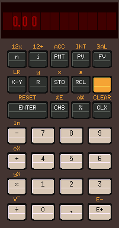
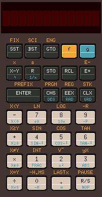
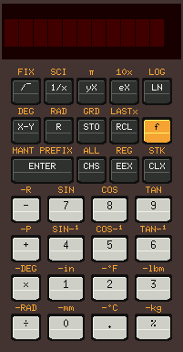

## x11-calc - Another RPN (Reverse Polish) calculator.

   

  

 

Written in C using X11.

Use  of any language extensions or non standard language features has  been
avoided in order to try to make the code as portable as possible. Currently
it will only compile without modification on Linux (Debian 10), but as with
earlier  versions of the intention is to be able to compile the code on VMS
running on either VAX or Alpha processors, and Tru64 Unix running on Alpha.

### Compiling

To build a the simulator for a particular model on Linux or Tru64 UNIX edit
the make file and change the value of the MODEL number, then do 'make all'.

On VMS use '@make.com'.

### Status

Currently very much work in progress. The CPU simulation code is now mostly
complete but several important functions remain to be implemented and it is
likely that the memory data structures will have to be revised.

##### HP21 - Working 

##### HP 22 - Working
The  following issues were observed when checking the behaviour against the
examples in the owners handbook..
* The examples on pages 65, 66 and 76 only work if END is selected.

##### HP 25 - Work in progress.
* Add support for missing opcodes.

##### HP 27 - Only keyboard working.

##### HP 29 - Only keyboard working.

##### HP 31 - Work in progress.
* Add support for missing opcodes.
* Implement on/off switch.
* Fix display.

##### HP 32 - Only keyboard working.

##### HP 33 - Only keyboard working.

### Known Issues

Attempting to compile using a later version of 'gcc' will result in several
warning  messages being generated due to the the use of 'ftime()' which has
been deprecated.

Need  to sort out colour mapping to allow program to run on a display  with
less than 24 -bit colour - may get round to this be one day...

The  X11 implementation on the Raspberry Pi 4 is just too slow to draw  the
display without it flickering (but it works well on the Jetson Nano, and an
old P4 with Intel graphics).
