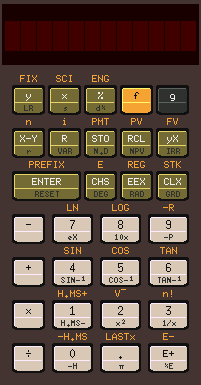
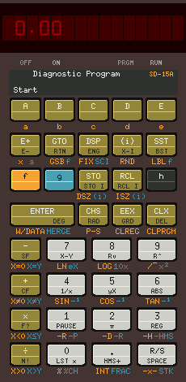
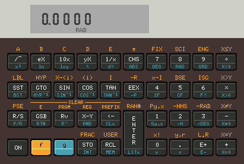
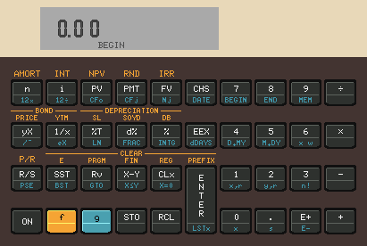

<a id="top"></a>

[](https://repology.org/project/x11-calc/versions)

## x11-calc - Another RPN (Reverse Polish) calculator

Includes emulators for the HP35, HP80, HP45, HP70, HP55, HP21, HP22,  HP25,
HP25C, HP27, HP29C, HP31E, HP32E, HP33E, HP33C, HP34C, HP37E, HP38C, HP38E,
HP10, HP67, HP10C, HP11C, HP12C,  HP15C, and HP16C calculators.

All written in C using X11.

Use  of any language extensions or non standard language features has  been
avoided in order to try to make the code as portable as possible.

The  aim  is to have the same source code compile without  modification  on
as  many  systems  and architectures as possible including  Linux,  NetBSD,
MacOS, VMS, Solaris and Tru64 Unix.

   

  

### Contents <sup><sup>[Back to Top](#top)</sup></sup>

- [Changes](#changes)

- [Installing/Building](#obtaining)

- [Tested Systems](#tested)

- [User Guide](./GUIDE.md#top)

- [Known issues](#issues)

- [Acknowledgements](#acknowledgements)

- [Submitting a problem report](#problems)

- [More screenshots](./img/#top)

<a id="changes"></a>
### Changes <sup><sup>[Back to Top](#top)</sup></sup>

Details of the latest/important changes.

14 Dec 25  (0.23.0224)

   - HP67 program card files can include text labels.
   - Added Portuguese language support for help text and error messages.

19 Nov 25

   - Allows the memory size to be increased from the command line. This can
     then be used by modified firmware versions to provide extra  registers
     and additional program steps.

18 Oct 25

   - Added support for the HP67 card reader (requires GTK).

14 Sep 25  (0.19.0194)

   - Added the HP55 complete with timer.

05 Sep 25  (0.18.0188)

   - Fixed issues that prevented the file selection dialog from being shown
     when using Flatpak.

24 Aug 25  (0.18.0187)

   - HP37E now passes self test.
   - Loading  or saving the current state can now be done by right clicking
     on  the application window.  In `run` mode the user will be prompted  to
     load the state from a previously saved `.dat` (data) file, while in `prgm`
     mode the user will be prompted to save the current state.

09 Aug 25  (0.17.0181)

   - Improved display updates (using double buffering).
   - Minor changes to fix compilation issues on VAX and DEC Windows.

08 Jul 25

   - Finally managed to get the HP10 working!!
     Note that there is no graphical display for the printer, the output is
     to `stdout` on the comsole.  This allows the output from the printer  to
     be redirected to a file if required.

07 Jul 25

   - Fixed regression bug that affected HP12C.

30 Jun 25

   - Enable the use of the `-c`, or `--comma` command line option to modify
     the state of the hardware link that controls decimal point format.

14 Apr 24

   - Allows the size of the window to be adjusted using the `--zoom n` option
     where n can be between 0 and 4.
   - Added an install option to the makefile (by default the installer will
     use `$HOME/.local` if it exists, but it is possible to specify another
     directory by setting the directory `prefix`).
   - Embedded missing firmware.

24 Feb 24

   - By default the application will attempt to use the X11 base fonts. But
     if these are not available it will try to select an suitable alternate
     font instead from a predefined list.

     For all the fonts to be rendered as intended users should ensure  that
     the X11 base fonts are installed (see prerequisites).

16 Feb 24

   - For UNIX based systems the default location used to store the state of
     the machine when it is powered off has changed.

     If the data file already exists in `$HOME` then this will always be used
     by default, but if it does not exist then if `$XDG_DATA_HOME` is defined
     the program will create a sub directory in this location for the  data
     files or in or `$HOME/.local/share/` if `$XDG_DATA_HOME` is not defined or
     does not exist. If `$HOME/.local/share/` does not exist then the program
     will use `$HOME` as before.

13 Jun 13

   - Initial version can draw the application window using X11!

<a id="obtaining"></a>
### Building/Installing <sup><sup>[Back to Top](#top)</sup></sup>

You can either download the source code from GitHub and compile it yourself
or you can use a pre-compiled package.

   - [Building from the source](#building)

   - [Using binary package](#packages)


<a id="packages"></a>
### Using a pre-compiled package <sup><sup>[Back to Top](#top)</sup></sup>

#### Alpine Linux
A binary package is available for Alpine Linux 3.20 and later.

If  X11 is not already installed, either add it using `setup-xorg-base`  or
install it together with a standard desktop using `setup-desktop`.

Make  sure `community` repo is enabled and then install x11-calc by running
the command `apk add x11-calc` as root.

Additional programs may be installed with `apk add x11-calc-prg`.

#### Flatpak
If  you  don't  want  to compile the application yourself  you  can  use  a
flatpak.

Follow the instructions for your distribution to install Flatpak.

Logout and Login again.

Add the Flathub repository.
```
flatpak remote-add --user --if-not-exists flathub https://dl.flathub.org/repo/flathub.flatpakrepo
```
Install the emulator.

Note - Although the application only requires less then 2MB of storage this
will  also install the run-time environment needed by Flatpak (if it is not
already installed) which could require up to 925 MB of disk space!  However
even  if  the run-time is not installed the disk space used is usually only
about half that.
```
flatpak install flathub io.github.mike632t.x11-calc
```
Start it
```
flatpak run io.github.mike632t.x11-calc
```
The  first time the application runs you will be prompted to select  which
model calculator you want to use.

If later you want to use a different calculator model you can specify it on
the command line.
```
flatpak run io.github.mike632t.x11-calc hp21
```


<a id="building"></a>
### Building from the source <sup><sup>[Back to Top](#top)</sup></sup>

#### Prerequisites

If you want to compile the emulators from the source code yourself then the
following packages must be installed.

   - Alpine   : gcc | clang | tcc make libx11-dev xorg-x11-fonts-base [gtk+3.0-dev]

   - Debian   : gcc | clang | tcc make libc6-dev libx11-dev xfonts-base [libgtk-3-dev | libgtk2.0-dev]

   - Fedora   : gcc | clang make glibc-devel libX11-devel xorg-x11-fonts-base | xorg-x11-fonts-misc [gtk3-devel]

   - Gentoo   : gcc make libc6-dev libx11-dev font-misc-misc [x11-libs/gtk+]

   - MacOS    : [Xcode](https://developer.apple.com/xcode/) [Xquartz](https://www.xquartz.org/)

   - NetBSD   : clang | gcc pmake

   - SUSE     : gcc | clang make libX11-devel

   - Solaris 10 : SUNWgcc SUNWgccruntime SUNWtoo SUNWhea SUNWxwhl SUNWgmake

   - Ubuntu : gcc | clang make libc6-dev libx11-dev xfonts-base [libgtk-3-dev]

   - Windows 11 + WSL2 : gcc make libc6-dev libx11-dev xfonts-base

When all the prerequisites are available, you should be able to compile the
application using make (or gmake).

Note - GTK is an optional dependency and is only required to allow users to
load or save programs.  The emulator will still compile but without the GTK
libraries  the ability to right click on the application window and load or
save  programs won't be available.

#### Compiling

To  build the emulators check that you have all the [prerequisites](#Prerequisites) installed
then download the source code from github and unzip it (this will created a
new directory automatically).

##### Linux/NetBSD

```
$ wget https://github.com/mike632t/x11-calc/archive/refs/heads/stable.zip
$ unzip stable.zip
```
Then change directory to the new folder.
```
$ cd x11-calc-stable
```
To compile all the emulators you just need to invoke make.
```
$ make clean; make all
```
You can also compile an emulator by specifying the model number.
```
$ make hp67
```
To build a version with support for a different locale specify the language
before invoking make.  (This only changes the message text displayed by the
emulator on the console not they way it behaves).
```
LANG=pt_BR make clean hp21
```
By default the executable files will be created in the `bin` directory.
```
$ bin/x11-calc-67
x11-calc-67: Version 0.19.0198 [Commit Id : 751ab27] gcc version 8.3.0 19 Oct 25 20:51:51
ROM Size: 8192 words
Loading '/home/system/.local/share/x11-calc/x11-calc-67.dat'
```
OR
```
$ bin/x11-calc
```
If more than one C compiler is installed or if gcc is not available you can
specify which one to use from the command line.
```
$ make CC=clang hp11c

$ make CC=tcc
```

##### Tru64 UNIX

To compile all the emulators you just need to invoke make.
```
$ make clean; make all
```
You can also compile a single emulator by specifying the model number.
```
$ make hp29c
```
By default the executable files will be created in the `bin` directory.
```
$ bin/x11-calc-29c
```

##### Solaris 10

You  need to be able to use the GNU tools so you have need to include their
location in your PATH.
```
$ PATH=$PATH:/usr/sfw/bin/
```
Download the source code, unzip it, and change to the new directory.
```
$ wget https://github.com/mike632t/x11-calc/archive/refs/heads/stable.zip
$ unzip stable.zip
$ cd x11-calc-stable
```
Since `gcc` isn't the default compiler you need to specify it when invoking
`gmake`.
```
$ gmake CC=gcc clean hp21
```
```
$ gmake CC=gcc clean all
```
By default the executable files will be created in the `bin` directory.
```
$ ./bin/x11-calc-33c
x11-calc-33c: Version 0.19.0198 [Commit ID: 992cf145] gcc version 3.4.3 19 Oct 25 20:32:48
ROM Size: 4096 words
```

##### VMS

On VMS unzip the source code archive, change the default directory and then
run `make.com`.
```
$ unzip stable.zip
$ set def [.x11-calc-stable.src]
$ @make all

$ mc [-.bin]x11-calc-29c
x11-calc-29c: Version 0.10 [Commit ID: 399d546] 02 Nov 23 23:52:11 (Build: 0114)
ROM Size : 4096 words
```

#### Installing

On Linux systems after the compilation is complete you can use the makefile
to install the emulators locally.

By default the installer will use `$HOME/.local` if it exists, but it is
possible to specify another directory by setting the directory `prefix`.
```
$ make install

OR

$ make install prefix=/usr
```
The makefile also supports staged installs in a custom directory defined by
DESTDIR.
```
make DESTDIR=/tmp/staging install
```


<a id="tested"></a>
### Tested Systems<sup><sup>[Back to Top](#top)</sup></sup>

Where it has not been possible to test the latest version the last working
release is shown (if known).  The will be maintained in the repository and
can be obtained from the 'legacy' branch.

   - Alpine 3.20, gcc 13.2.1, x86_64 + arm64

   - Alpine 3.19, gcc 13.2.1, x86_64 + arm64  (0.16.0172)

   - Debian 13 (Trixie), gcc 14.2.0 | clang 19.1.7 | tcc 0.9.27, x86_64

   - Debian 12 (Bookworm), gcc 12.2.0 | clang 14.0.6 | tcc 0.9.27, x86_64 + arm64

   - Debian 11 (Bullseye), gcc 10.2.1 | clang 11.0.1-2, i686 + x86_64  (0.19.0195)

   - Debian 10 (Buster), gcc 8.3.0, arm  (0.16.0172)

   - Debian 10 (Buster), gcc 8.3.0 | clang 7.0.1 | tcc 0.9.27, x86_64

   - Debian 9 (Stretch), gcc 6.3.0, arm  (0.16.0172)

   - Debian 5 (Lenny), gcc 4.2.4, alpha

   - Debian 5 (Lenny), gcc 4.3.2, i686

   - Fedora 35, gcc 11.3.1 | clang 13.0.1, x86_64

   - Fedora 39, gcc 13.2.1 | clang 17.0.6, x86_64  (0.19.0195)

   - Fedora 41, gcc 14.3.1 | clang 19.1.7, x86_64  (0.19.0195)

   - Fedora 42, gcc 15.2.1 | clang 20.1.8, x86_64  (0.19.0195)

   - Fedora 43, gcc 15.2.1 | clang 21.1.5, x86_64

   - FreeBSD 14.0, clang 16.0.6, x86_64  (0.19.0195)

   - Gentoo, gcc 11.2.0, x86_64  (0.19.0195)

   - MacOS 10.1.15 (Catalina), clang 12.0.0, x86_64  (0.19.0195)

   - MacOS 12.7.6 (Monterey), clang 14.0.0, x86_64

   - MacOS 13.4.1 (Ventura), clang 14.0.3, arm64  (0.19.0195)

   - MacOS 14.4.1 (Sonoma), clang 15.0.0, arm46  (0.19.0195)

   - MacOS 25.1.0 (Tahoe), clang 17.0.0, x86_64  (0.19.0195)

   - Minix 3.4.0, clang 3.6, x86  (0.19.0195)

   - NetBSD 9.2, gcc 7.5.0 | clang 16.0.6, x86  (0.19.0195)

   - SunOS 5.10, gcc 3.4.3, x86

   - SUSE 15.4, gcc 7.5.0 | clang 13. 0.1, x86_64  (0.19.0195)

   - Tru64 5.1, cc 6.5-011, alpha

   - Ubuntu 20.04, gcc 9.4.0 | clang 10.0.0 | tcc 0.9.27, x86_64 + aarch64

   - Ubuntu 22.04, gcc 11.4.0 | clang 14.0.0 | tcc 0.9.27, x86_64 + aarch64

   - Ubuntu 24.04, gcc 13.3.0 | clang 14.0.6 | tcc 0.9.27, x86_64 + aarch64

   - VMS 5.4-3, VAX C 3.2, VAX

   - VMS 7.3, C 6.5, VAX

   - VMS 7.3-2, C 6.5, alpha

   - VMS 9.2-1, C 7.4, x86_64

   - Windows 11 + WSL2, gcc 12.2.0, x86_64 + arm64

   - Windows 11 + WSL2 (Ubuntu 24.04 LTS), gcc 13.3.0, x86_64

   - Windows 11 + WSL2 (Debian 13), clang 19.1.7 | gcc 14.2.0, x86_64

The last tested release is shown if this release has not yet been tested on
a particular system.

<a id="acknowledgements"></a>
### Acknowledgements <sup><sup>[Back to Top](#top)</sup></sup>

There are almost certainly some names I've missed off this list but without
the  help and encouragement from members of the calculator community it  is
unlikely that this project would have happened at all or that I would  have
managed to get as far as I have.

- `Teenix` for convincing me that it was possible in the first place.

   Though he omitted to warn that the once I got one working I would get an
   overwhelming urge to add as many many models as possible (including some
   I didn't think were possible!)

- `Teenix`  and `Panamatik` for their excellent emulators from which I  was
   able to figure out most of what should happen when each  instruction  is
   is executed.

- `Agarza` for providing the details of the voyager displays.

- `Macmpi` for completely rewriting the make files and maintaining backward
   compatibility with Tru64 UNIX while doing so!

- `Macmpi` for packaging the emulators for Flatpak and setting up the build
   so new releases are built automatically.

- `Macmpi` for packaging and testing the emulators on Alpine Linux.

- `Agarza` and `Martin HEPPERLE` for helping to translate the help text.

- `Brouhaha` for taking the time to explain the workings of various models.

- `Thomas KLEMM` for his testing and debugging efforts on MacOS.

- `Mark SHIN` for testing on MacOS.

- `Jonakeys` for getting the emulators working on FreeBSD.

- `Quozl` for helping with double buffering display changes.

- `Kjellc` for adding support for the HP67 card reader.

- `Vttoth` for allowing me to include some of his example programs.

- `Kjellc` for translating the help text (into Swedish).

<a id="issues"></a>
### Known Issues <sup><sup>[Back to Top](#top)</sup></sup>

#### General

- A 24 bit colour display is required.
- Keyboard shortcuts are only available on UNIX like systems.
- For best results you need to have the X windows core fonts installed.
- Parallel make only works on Linux, NetBSD and FreeBSD.
- The timer on the HP55 isn't very accurate (no crystal oscillator!)

##### HP 67

- Has continuous memory by default.  Use the '--reset' option to disable it
  when starting the emulator.

##### HP 11C + HP 12C + HP 15C + HP 16C

- Keyboard test is successful but these models do not pass the self-test.

#### Wayland Issues

- The application window should be a fixed size (this can be modified using
  '--zoom'), but Wayland does not allow applications to be a fixed size.

#### VMS

- Colour palette assumes a black and white display. If the system's  colour
  depth is different you will have to modify COLOUR_DEPTH to match, however
  the display will still only use two colours.
  (You can modify x11-calc-colour.h and x11-calc.h to change `vms` to `oldvms`
  if you do have a 24-bit colour display).
- Not all text is visible if not using 24-bit colour.
- Not all key labels are shown as the DEC fonts are missing some characters.

<a id="problems"></a>
### Problem Reports <sup><sup>[Back to Top](#top)</sup></sup>

If  you encounter an issue or have suggestions for future changes to  these
emulators, then please create a new [issue](https://github.com/mike632t/x11-calc/issues).

Your problem report should contain:

- Whether you are using a pre-built binary (Alpine / Flatpak);

- The output from `sh-get-environment.sh`;

- The commit ID;

- A description of the problem.

Thank you.
