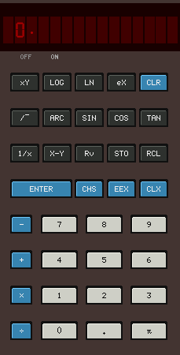
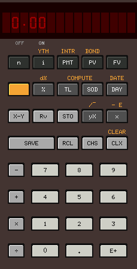
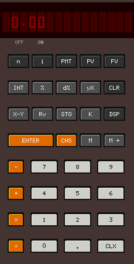
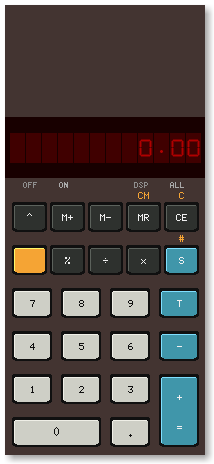
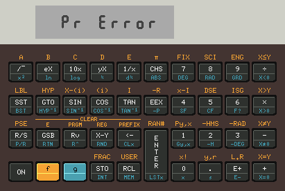
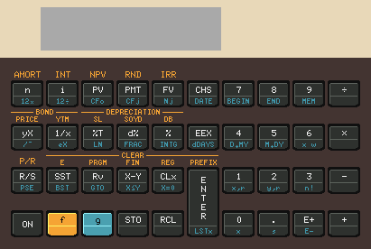
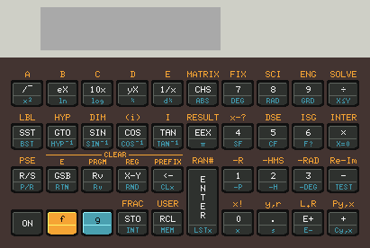
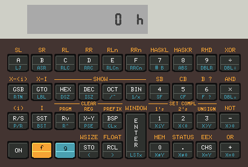

## x11-calc - Another RPN (Reverse Polish) calculator.

Simulators for the HP 35, HP 80, HP 45, HP 70, HP 21, HP 22, HP 25C, HP 27,
HP 29C, HP 31E, HP 32E, HP 33C, HP 34C, HP 37E, HP 38C and HP 67 written in
C using only X11.

### Screenshots

   

  

 

  

  

 

 

